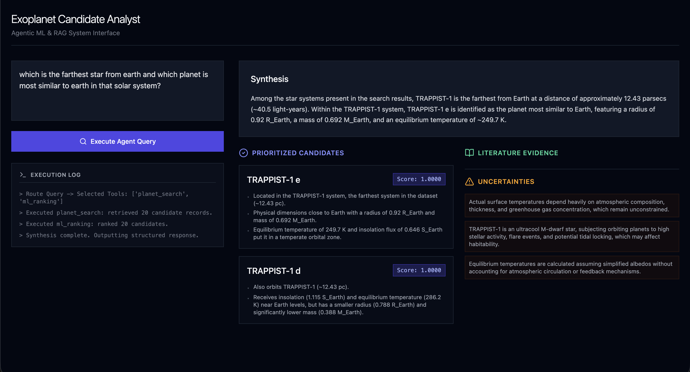

# Exoplanet Candidate Analyst

An Agentic Machine Learning and Retrieval-Augmented Generation (RAG) system for the prioritization, analysis, and discovery of exoplanet candidates. 

This full-stack application provides an interactive LLM-powered research agent, multi-tool reasoning capabilities, tabular candidate ranking, and a Neo4j-backed knowledge graph to connect planetary data with scientific literature.

---



## 🎯 The Problem

Exoplanet science has a triage problem: the number of known candidates is growing far faster than the capacity to study any of them in detail.

- **The candidate backlog is large and growing.** TESS alone had catalogued over **7,800 planet candidates by early 2026**, while **fewer than 720** have been independently confirmed — a gap of more than 7,000 unresolved signals that manual, one-by-one vetting was never designed to handle at this scale ([ExoNet, 2026](https://arxiv.org/abs/2604.15560)). This project's data pipeline pulls in exactly that backlog (Kepler KOI + TESS TOI candidates, not just the ~6k confirmed planets) so the ranking model has the full triage problem to work with, not just the already-solved cases.
- **Follow-up telescope time is scarce and heavily oversubscribed.** JWST's Cycle 5 General Observer call requested **99,782 hours against roughly 8,000 available**, an oversubscription of about **12:1** — and exoplanet atmosphere/habitability science alone accounted for **14% of all approved prime time**, among the most competitive categories on the telescope ([STScI, JWST Cycle 5 Proposal Selection](https://www.stsci.edu/contents/newsletters/2026-volume-43-issue-01/jwst-cycle-5-proposal-selection)). Every hour spent characterizing the wrong candidate is an hour a genuinely promising one doesn't get.
- **This is why similarity-based ranking already exists as real scientific infrastructure.** NASA's Exoplanet Exploration Program maintains a curated [Target Star Catalog](https://science.nasa.gov/exoplanets/target-star-catalog/) specifically to narrow the search space for the upcoming Habitable Worlds Observatory before it ever launches, and the Planetary Habitability Laboratory's Earth Similarity Index was built explicitly so it "can be used to prioritize exoplanet observations, perform statistical assessments and develop planetary classifications" ([Earth Similarity Index and Habitability Studies of Exoplanets, arXiv:1801.07101](https://arxiv.org/pdf/1801.07101)).

**This project is a smaller-scale, student-built version of that same triage tool**: given NASA's confirmed-planet and candidate catalogs, rank every entry by physical similarity to Earth using a validated ML model, so that limited follow-up attention — human or telescope — goes to the candidates most likely to be worth it. The literature-retrieval component addresses the adjacent problem of keeping up with what's already been published about a given candidate, since the field publishes faster than any one researcher can track manually.

This also means the `ml_score` this project produces should be read the same way the field reads ESI or an HWO target list: a similarity/priority ranking to guide where to look next, not a claim that a planet is confirmed habitable — no dataset of confirmed-habitable exoplanets exists for any model to be validated against.

---

## 🏗 System Architecture

* **Frontend:** React 18, TypeScript, Vite, Tailwind CSS, Lucide Icons.
* **Backend:** FastAPI (Python), LangChain/LangGraph (Agent Orchestration).
* **Data Layer:** 
  * Tabular: SQLite (`planets.db`) / Parquet (`planets.parquet`)
  * Graph: Neo4j (Knowledge Graph for stars, planets, and papers)
  * Vector/RAG: Document retrieval over scientific literature (`papers.jsonl`)
* **ML Layer:** Custom scikit-learn/XGBoost pipelines for habitability and similarity scoring.

---

## 📁 Repository Structure

```
.
├── backend/
│   ├── app/
│   │   ├── agent/       # LangGraph execution graph and multi-step reasoning
│   │   ├── api/         # FastAPI routes and endpoint definitions
│   │   ├── ml/          # ML scoring and candidate ranking pipelines
│   │   ├── rag/         # Document retrieval and vector search capabilities
│   │   ├── services/    # External integrations (LLM providers, Neo4j driver)
│   │   └── tools/       # Agent tools (planet_search, ranking, literature, kg)
│   ├── data/            
│   │   ├── processed/   # SQLite and Parquet databases
│   │   └── raw/         # Source CSVs and JSONL literature datasets
│   ├── tests/           # Pytest integration and unit test suite
│   ├── main.py          # FastAPI application entry point
│   └── requirements.txt # Python dependencies
└── frontend/
    ├── src/
    │   ├── App.tsx      # Main Agent Dashboard and chat UI
    │   ├── main.tsx     # React DOM entry
    │   └── index.css    # Tailwind entry point
    ├── package.json     # Node.js dependencies
    ├── vite.config.ts   # Vite bundler configuration
    └── tailwind.config.js
```

## 🛠 Local Development Setup
Prerequisites
Node.js (v18+)

Python (v3.9+)

Neo4j instance (Local Desktop or AuraDB)

LLM API Key (OpenAI, Anthropic, or local Ollama setup)

1. Backend Setup
Navigate to the backend directory and set up an isolated Python environment:
```
cd backend
python -m venv venv
source venv/bin/activate  # On Windows: venv\Scripts\activate
pip install -r requirements.txt
```


Environment Variables:
Create a .env file in the backend/ directory:

```
# LLM Provider
GEMINI_API_KEY=your_api_key_here

# Neo4j Database
NEO4J_URI=bolt://localhost:7687
NEO4J_USERNAME=neo4j
NEO4J_PASSWORD=your_password

# Application Settings
CORS_ORIGINS=http://localhost:5173

```

Start the Development Server:
```
uvicorn main:app --reload --port 8000
```

The backend API will be available at `http://localhost:8000`.
Swagger UI documentation will be available at `http://localhost:8000/docs`

2. Frontend Setup
Open a new terminal window, navigate to the frontend directory, and install dependencies:
```
cd frontend
npm install
```
Environment Variables (Optional):
If you need to configure the API URL explicitly, create a .env in the frontend/ directory:
```
VITE_API_BASE_URL=http://localhost:8000
```

Start the Development Server:
```npm run dev```


### 📡 API Contract Overview
| Method | Endpoint | Description |
| :--- | :--- | :--- |
| **POST** | `/api/chat` | Main agentic interaction endpoint. Returns synthesized answers, executed reasoning steps, candidate scores, and supporting literature. |
| **GET** | `/api/planets` | Fetches tabular candidate data. Supports query params like `max_distance`, `max_radius`, and `discovery_method`. |
| **GET** | `/api/planets/{name}` | Returns detailed physical parameters for a specific star and planet. |
| **GET** | `/api/planets/{name}/graph` | Returns a serialized Neo4j node/edge subgraph for visualization. |
| **POST** | `/api/rank` | Accepts hypothetical planetary attributes (`pl_rade`, `pl_eqt`, etc.) and returns an ML habitability/priority score. |

